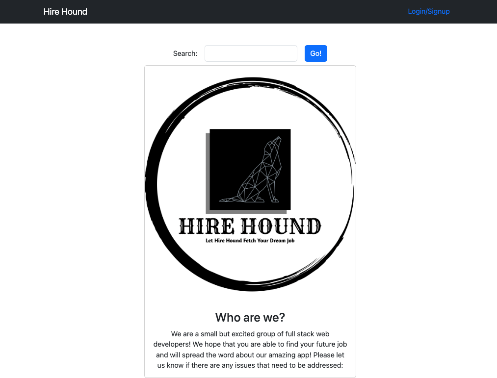
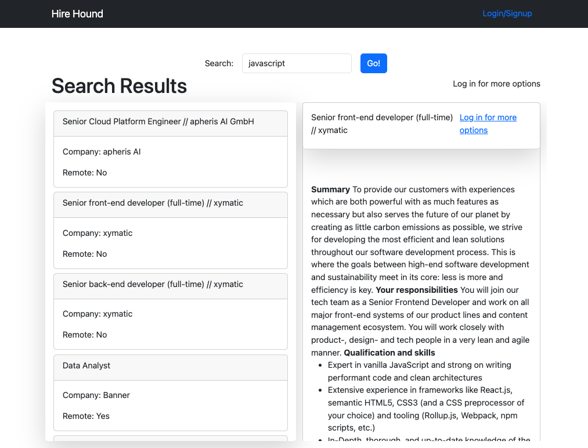
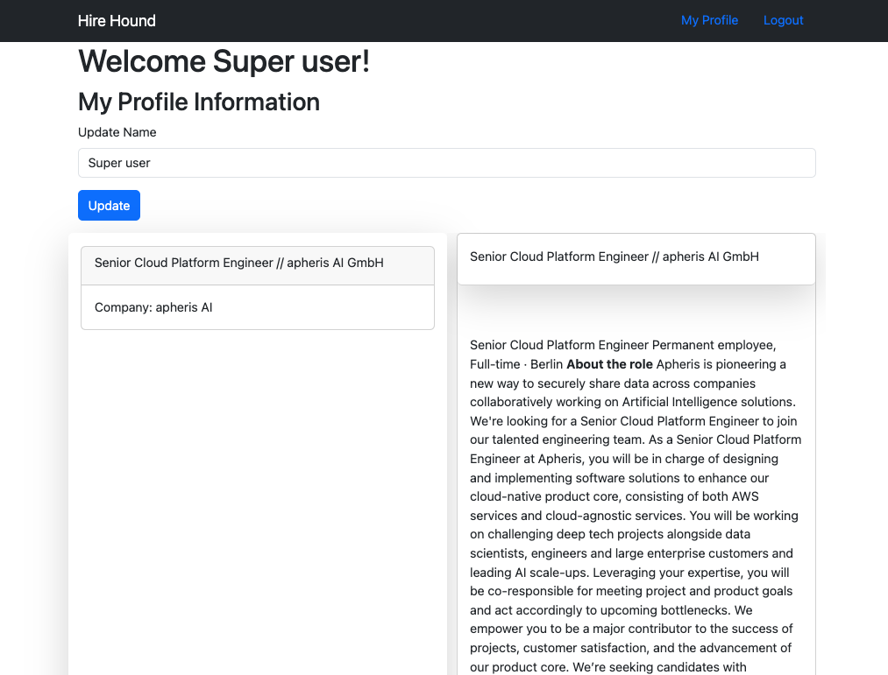
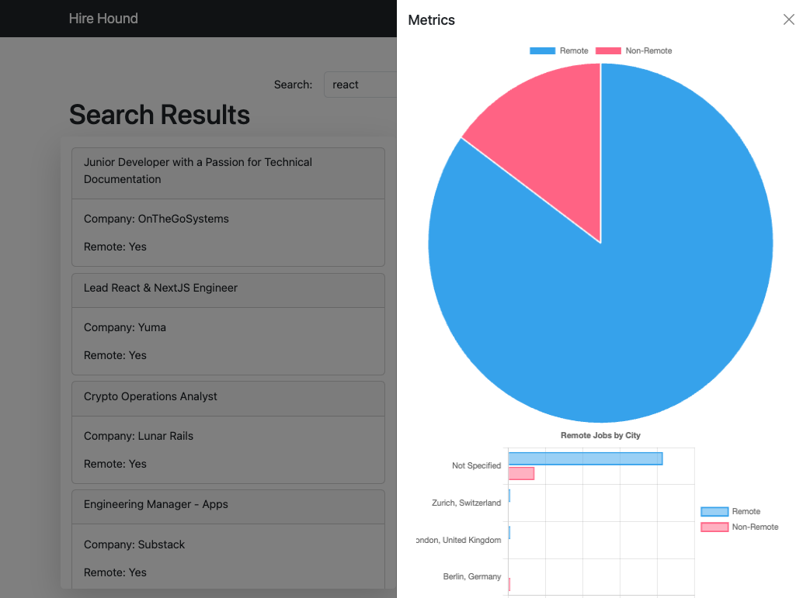

# Job Board

# _Hire Hound_

## Description:

On the hunt for a job? Hire Hound has you covered. Not only does the web application provide a thorough search engine, it allows the user to create its own profile to save job listings (including job description, company name, date posted and URL link).

## Technologies Used

- NodeJS, HTML, CSS, JS, Bootstrap
- Handlebars.js
- MySQL
- [Findwork.dev API](https://findwork.dev/developers/)
- [Chart.js](https://www.chartjs.org/docs/latest/)

## Table of Contents:

- [Collaborators](#collaborators)
- [User Story](#user-story)
- [Acceptance Criteria](#acceptance-criteria)
- [Links](#links)
- [How to](#how-to)
- [Future Development](#future-development)
- [Screenshots](#screenshots)

## Collaborators

| Developer | GitHub Profile                        |
| --------- | ------------------------------------- |
| Courtney  | https://github.com/csherman177        |
| Trace     | https://github.com/trace-martin       |
| Sergio    | https://github.com/sergiorodriguezdev |

## User Story

```
AS A developer looking for a job
I WANT to use an online job board that allows me to search for jobs and save job descriptions under my profile
SO THAT I can track jobs that I am interested in and refer back to the original job descriptions.
```

## Acceptance Criteria

```
GIVEN an online job board
WHEN I search for a job in the search bar
THEN I see a list of relevant job listings
WHEN I attempt to log in
THEN I am routed to a login page which also gives me the option to sign up for a free account
WHEN I search for a job and am logged in
THEN I can save jobs I am interested in and see charts reflecting metrics based on the search results
WHEN I click the 'My Profile' link
THEN I am routed to my profile page which lists the jobs I have previously saved
```

## Links

Deployed app:
- https://hire-hound.herokuapp.com/

GitHub repo:
- https://github.com/trace-martin/Job-Board-Project-2

## How to

### Job Search

1. Enter your search criteria in the search box.
2. When presented with the search results, click on any job in the list of results to display the full job description.
3. As a logged in user, you have the option to click the `Save` button to add the job to your list of saved jobs.
4. As a logged in user, you have the option to click the `Metrics` link to display data visualization charts that provide metrics for your job search.

### User Profile

1. Once you have signed up or have logged in, click the `My Profile` link in the navigation bar.
2. You have the option to update your name.
3. You will be presented with a list of saved jobs you can refer back to and view their full job descriptions..

## Future Development

- Add pagination to the search results page. We currently limit the search results to 1 page (up to 100 jobs).
- Allow user to remove saved jobs from their profile.

## Screenshots







